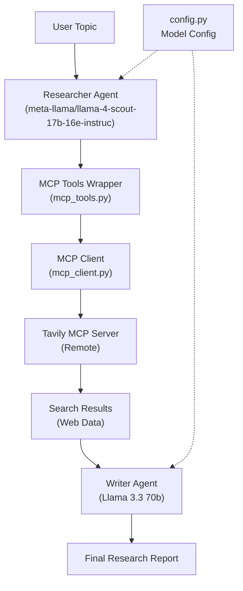

# ResearchMind
AI-powered research system built with LangChain, Groq, Tavily MCP, and Streamlit.


## Overview
ResearchMind takes a topic and runs a 2-step pipeline powered by MCP:
1. **Researcher Agent** - Uses Tavily MCP to search the web for relevant information
2. **Writer Agent** - Generates a structured research report based on findings

The project supports:
- CLI execution (`pipeline.py`)
- Streamlit UI execution (`app.py`)

## Architecture

The system uses the **Model Context Protocol (MCP)** to integrate with Tavily's web search service:

```
User Input → Researcher Agent → MCP Tools → Tavily MCP Server → Writer Agent → Report
```

## Features
- **Researcher Agent** using Tavily MCP for web search
- **Writer Agent** for report generation
- **Separate Groq LLM instances** - Mixtral 8x7b for research, Llama 3.3 70b for writing
- **MCP Integration** - Standardized protocol for tool integration
- **Streamlined 2-step pipeline** - Efficient research workflow
- **Real-time processing feedback** - Live thinking/progress display
- **Downloadable markdown reports** from Streamlit UI
- **Optimized search** - 2-3 results per query via MCP
- **Remote MCP Server** - No local installation needed

## Tech Stack
- Python 3.12+
- LangChain (`langchain`, `langchain-core`, `langchain-community`)
- `langchain-groq` - Groq LLM integration
- `mcp` - Model Context Protocol
- Streamlit - Web UI
- Tavily MCP Server (Remote)
- BeautifulSoup + Requests - Web scraping
- `python-dotenv` - Configuration
- `uv` - Dependency management

## Pipeline Flow



## Project Structure
```bash
multi-agent-research-system/
├── agents.py           # LLM setup + agent and chain builders
├── tools.py            # Non-MCP tools (scrape_url)
├── mcp_client.py       # MCP connection manager
├── mcp_tools.py        # LangChain MCP tool wrappers
├── config.py           # LLM model configuration
├── pipeline.py         # CLI pipeline runner
├── app.py              # Streamlit web UI
├── error_handling.py   # Error normalization utilities
├── pyproject.toml      # Dependencies and project metadata
├── uv.lock             # Lockfile for reproducible installs
├── MCP_INTEGRATION.md  # MCP setup & configuration guide
├── MCP_INTEGRATION_TEST.py  # MCP interation test suite
└── README.md
```

## Setup

### 1. Clone repository
```bash
git clone <your-repo-url>
cd multi-agent-research-system
```

### 2. Install dependencies
```bash
uv sync
```

### 3. Create `.env` and add API keys
```env
GROQ_API_KEY=your_groq_api_key_here
TAVILY_API_KEY=your_tavily_api_key_here
```

Get free API keys:
- **Groq**: [console.groq.com](https://console.groq.com)
- **Tavily**: [tavily.com](https://tavily.com)

## Run

### CLI
```bash
uv run pipeline.py
```

### Streamlit Web UI
```bash
uv run streamlit run app.py
```

Then open `http://localhost:8501`

## How MCP Integration Works

1. **Researcher Agent** receives topic from user
2. **Agent** calls `tavily_search()` from `mcp_tools.py`
3. **MCP Tools Wrapper** formats the request
4. **MCP Client** (`mcp_client.py`) connects to remote Tavily MCP server
5. **Tavily MCP Server** performs the actual web search
6. **Results** returned through MCP protocol
7. **Writer Agent** receives search results and generates report

For detailed MCP setup and configuration, see [MCP_INTEGRATION.md](MCP_INTEGRATION.md)

## Configuration

### Model Selection
Edit `config.py` to change LLM models:
```python
RESEARCHER_MODEL = "meta-llama/llama-4-scout-17b-16e-instruct"
WRITER_MODEL = "llama-3.3-70b-versatile"
RESEARCHER_LLM_TEMPERATURE = 0.1    # Lower = more focused
WRITER_LLM_TEMPERATURE = 0.6        # Higher = more creative
```

### Search Parameters
Tavily MCP defaults to 3 results per query. Adjust in `mcp_client.py` if needed.

## Notes
- **MCP Client** reads `TAVILY_API_KEY` from `.env` and connects to remote server
- **Separate LLM instances** - Researcher and Writer use different Groq models
- **Pipeline state** - In-memory per run, no database required
- **Tool discovery** - Tools are statically defined; could be made dynamic in future
- **Remote MCP Server** - No local MCP server installation needed; uses cloud-hosted Tavily MCP

## Advantages of MCP

✅ **Standardized Protocol** - Industry-standard tool integration  
✅ **Easy Integration** - Simple tool wrapper for new MCP servers  
✅ **Scalability** - Add more MCP servers without code changes  
✅ **Security** - API keys handled securely  
✅ **Future-Proof** - Compatible with Claude, Cursor, and other MCP clients  

## Future Enhancements

- [ ] Dynamic tool discovery from MCP server
- [ ] Add `tavily_extract` tool for deeper content analysis
- [ ] Support multiple MCP servers (search + code + web browsing)
- [ ] Implement `tavily_crawl` for multi-page research
- [ ] Add conversation history across sessions

## References

- [Model Context Protocol Spec](https://spec.modelcontextprotocol.io/)
- [Tavily MCP GitHub](https://github.com/tavily-ai/tavily-mcp)
- [Tavily API Docs](https://docs.tavily.com/)
- [Groq Console](https://console.groq.com/)
- [LangChain Docs](https://python.langchain.com/)
