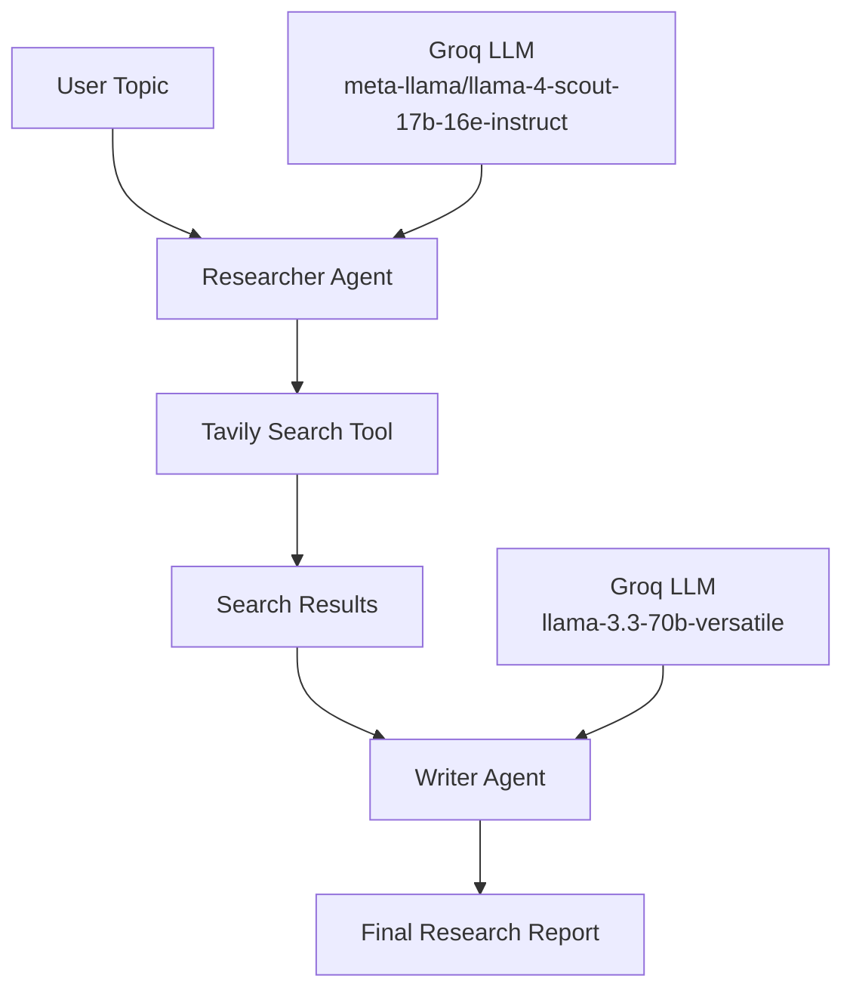

# ResearchMind
AI-powered research system built with LangChain, Groq, Tavily, and Streamlit.


## Overview
ResearchMind takes a topic and runs a 2-step pipeline:
1. **Researcher Agent** - Searches the web for relevant information using Tavily
2. **Writer Agent** - Generates a structured research report based on findings

The project supports:
- CLI execution (`pipeline.py`)
- Streamlit UI execution (`app.py`)

## Features
- Researcher agent using Tavily web search
- Writer agent for report generation
- Shared Groq LLM configuration in `agents.py`
- Streamlined 2-step pipeline
- Downloadable markdown report from Streamlit UI
- Optimized search (2-3 results per query)
- Concise webpage extraction (1200 char limit)

## Tech Stack
- Python 3.12+
- LangChain (`langchain`, `langchain-core`, `langchain-community`)
- `langchain-groq`
- Streamlit
- Tavily API
- BeautifulSoup + Requests
- `python-dotenv`
- `uv` for dependency management

## Pipeline Flow



## Project Structure
```bash
multi-agent-research-system/
├── agents.py        # LLM setup + agent and chain builders
├── tools.py         # web_search tool
├── pipeline.py      # CLI pipeline runner
├── app.py           # Streamlit app
├── error_handling.py # Error normalization utilities
├── assets/
│   └── architecture.png
├── pyproject.toml   # dependencies and project metadata
├── uv.lock          # lockfile for reproducible installs
└── README.md
```

## Setup

1. Clone repository
```bash
git clone <your-repo-url>
cd multi-agent-research-system
```

2. Install dependencies
```bash
uv sync
```

3. Create `.env` and add keys
```env
GROQ_API_KEY=your_groq_api_key_here
TAVILY_API_KEY=your_tavily_api_key_here
```

## Run

### CLI
```bash
uv run pipeline.py
```

### Streamlit
```bash
uv run streamlit run app.py
```

## Notes
- `agents.py` reads `GROQ_API_KEY` from `.env` via `python-dotenv`
- Both agents share a single lazily-initialized `ChatGroq` instance
- Pipeline state is in-memory per run
- Search results limited to 2-3 results per query for efficiency
- Webpage content truncated to 1200 characters for optimal token usage
